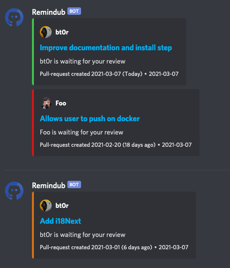

# Remindub

Remindub is a github's pull-request reminder for discord.
It allows you to receive notification on discord when someone is waiting for your review on a pull-request.

As pull-reminder (ex' pull-panda) have been bought by Github and only allows to receive notifications threw Slack, Remindub comes as an alternative.



**This project is currently under development, please do not use it in production or at your own risks.**

# Features
* Allows you to choose notifications days (working days, every day...)
* Shows different notification colors according to reviews delay
* Shows total delay in days
* Docker supports

# How to use it
Remindub is available on Docker threw Github Package.
You can simply use it by installing Docker and run this command : 

```BASH
docker run --mount type=bind,source=<absolute path of your config file>,destination=/app/config/config.yaml docker.pkg.github.com/bt0r/remindub/remindub:0.0.1
```

Please take a look at [config.yaml.dist file](config/config.yaml.dist) to know how to configure Remindub.

# How to contribute
You should be able to install the stack by simply use `make install` and `make start` to run it.

If you need more information or if you encountered issues, feel free to contact me on discussions.
